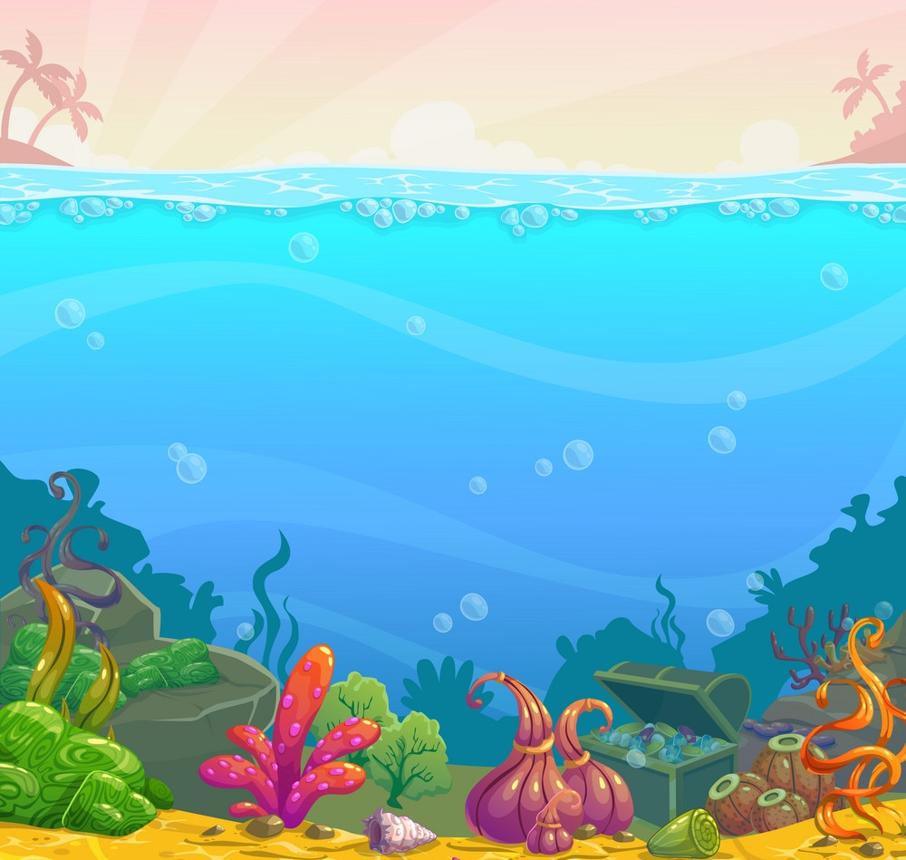

# 🌊 Aqu--Nova: Underwater Aquarium Animation Project 🐠

**Aqu--Nova** is a visually captivating **aquarium animation project** built using pure HTML, CSS, and SVG. This is not just another boring webpage — it's an animated underwater world full of fishes, bubbles, and a marine vibe.

---

## 🚀 Features

- 🐟 Smoothly animated fishes using SVGs
- 💧 Floating bubbles animation
- 🖼️ Realistic underwater background image
- 🌐 Built with only HTML & CSS (no JS required for animation)
- 💻 Fully responsive (runs in any browser)

---

## 🧠 Tech Stack

- HTML5
- CSS3 (Custom animations)
- SVG assets (fishes, bubbles)
- Background: `underwater.jpg`

---

## 📁 Project Structure

```
unwaterAnimation/
├── Animation.html         # Main animation page
├── Animation.css          # CSS for fish & bubble animations
├── bubbles.svg            # Bubble SVG
├── fish.svg               # Primary fish
├── fish2.svg              # Alternate fish
├── clown-fish.svg         # Cute clown fish
├── fishes.svg             # Multiple fish illustration
├── underwater.jpg         # Background image
├── README.md              # You're reading it 😎
```

---

## 📸 Preview



---

## 🛠️ How to Run

1. Download the repo / clone it:
   ```bash
   git clone https://github.com/SachinCoder11/Aqu--Nova.git
   ```

2. Open `Animation.html` in your browser.

3. Enjoy the underwater vibes 💙

---

## 📌 Notes

- Make sure all SVGs and the `underwater.jpg` are in the **same folder** or update the paths in HTML.
- If images don’t load, check filename case sensitivity and path.

---

## ✨ Author

**SachinCoder11**  
Made with ❤️, coffee, and a dream of swimming with code 🐬

